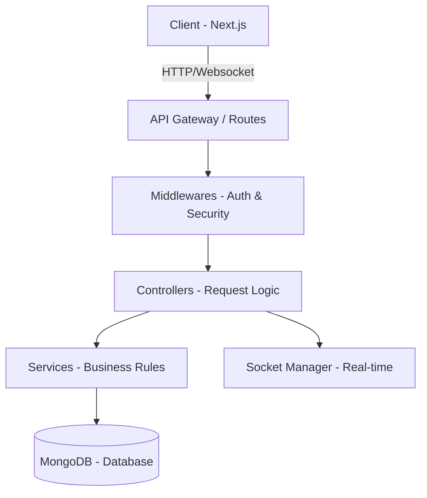

```markdown
<div align="center" dir="rtl">

# 🚀 منصتي – Mansati Backend API

### المحرك البرمجي للمنصة الاجتماعية العربية المتكاملة

<p align="center">
  
  
  
  
  
  
</p>

---

**منصتي** هي منصة اجتماعية حديثة مصممة بمعمارية الطبقات (Layered Architecture) لضمان الأداء العالي والأمان المطلق. يمثل هذا المستودع "المحرك الخلفي" الذي يدير البيانات والتواصل الفوري بين المستخدمين.

[](https://github.com/mohammed-dev-stack/mansati-frontend)
[](https://github.com/mohammed-dev-stack/mansati-backend/issues)

</div>

---

## 📖 جدول المحتويات

* [🏗️ هندسة النظام (Architecture)](#️-هندسة-النظام-architecture)
* [✨ المميزات التقنية](#-المميزات-التقنية)
* [⚙️ حزمة التقنيات (Tech Stack)](#️-حزمة-التقنيات-tech-stack)
* [📁 هيكلية الملفات](#-هيكلية-الملفات)
* [🚀 بدء التشغيل السريع](#-بدء-التشغيل-السريع)
* [📡 نظرة على الـ API](#-نظرة-على-الـ-api)
* [👨‍💻 المؤلف](#-المؤلف)

---

## 🏗️ هندسة النظام (Architecture)

يعمل النظام وفق مبدأ **Clean Architecture** لضمان فصل المهام وسهولة الصيانة:



---

## ✨ المميزات التقنية

### 🔐 الأمان والخصوصية

* **Authentication:** نظام JWT مزدوج (Access & Refresh Tokens) مخزنة في HttpOnly Cookies لحماية قصوى.
* **Security Headers:** حماية من الثغرات الشائعة باستخدام `Helmet.js`.
* **Rate Limiting:** حماية من هجمات الإغراق (DDoS) والـ Brute Force.
* **Data Sanitization:** تنقية البيانات لمنع هجمات NoSQL Injection.

### ⚡ الأداء والتواصل الفوري

* **Real-time:** تواصل فوري للدردشة والإشعارات عبر `Socket.io`.
* **File Handling:** نظام متكامل لرفع ومعالجة الصور باستخدام `Multer`.
* **Global Error Handling:** معالجة مركزية للأخطاء لضمان استقرار الخادم.

---

## ⚙️ حزمة التقنيات (Tech Stack)

| المجال | التقنية المستخدمة |
| --- | --- |
| **بيئة التشغيل** | Node.js (LTS 20+) |
| **إطار العمل** | Express.js (Version 5 ready) |
| **قاعدة البيانات** | MongoDB مع Mongoose ORM |
| **التواصل الفوري** | Socket.io |
| **التشفير والمصادقة** | Bcrypt.js & JSON Web Tokens |
| **رفع الملفات** | Multer |

---

## 📁 هيكلية الملفات

```text
backend/
├── config/             # إعدادات قاعدة البيانات والـ CORS
├── controllers/        # المنطق البرمجي لكل مسار (Business Logic)
├── middleware/         # الحماية، التحقق من الصلاحيات، ومعالجة الأخطاء
├── models/             # تعريف نماذج البيانات (Database Schemas)
├── routes/             # تعريف مسارات الـ API (Endpoints)
├── socket/             # إدارة أحداث الـ WebSockets والتواصل الفوري
├── utils/              # دوال مساعدة (Helpers)
├── .env.example        # نموذج لمتغيرات البيئة المطلوبة
└── server.js           # نقطة الانطلاق الرئيسية للخادم

```

---

## 🚀 بدء التشغيل السريع

1. **استنساخ المشروع:**
```bash
git clone [https://github.com/mohammed-dev-stack/mansati-backend.git](https://github.com/mohammed-dev-stack/mansati-backend.git)
cd mansati-backend

```


2. **تثبيت المكتبات:**
```bash
npm install

```


3. **إعداد البيئة:** قم بإنشاء ملف `.env` بناءً على `.env.example` وأضف رابط الاتصال بـ MongoDB الخاص بك.
4. **تشغيل الخادم (وضع التطوير):**
```bash
npm run dev

```


---

## 📡 نظرة على الـ API (Endpoints)

| الوظيفة | الطريقة | المسار |
| --- | --- | --- |
| **تسجيل مستخدم جديد** | `POST` | `/api/auth/register` |
| **تسجيل الدخول** | `POST` | `/api/auth/login` |
| **جلب المنشورات** | `GET` | `/api/posts` |
| **إرسال رسالة فورية** | `POST` | `/api/messages` |
| **إحصائيات الإدارة** | `GET` | `/api/admin/stats` |

---

## 👨‍💻 المؤلف

**محمد قنن (Mohammed Qannan)**
*Full-Stack Developer | TypeScript & Next.js Specialist*

---

<div align="center">

**منصتي – نحو تواصل عربي أكثر ذكاءً**

تم التطوير بكل ❤️ بواسطة محمد قنن | 2026

</div>

```
